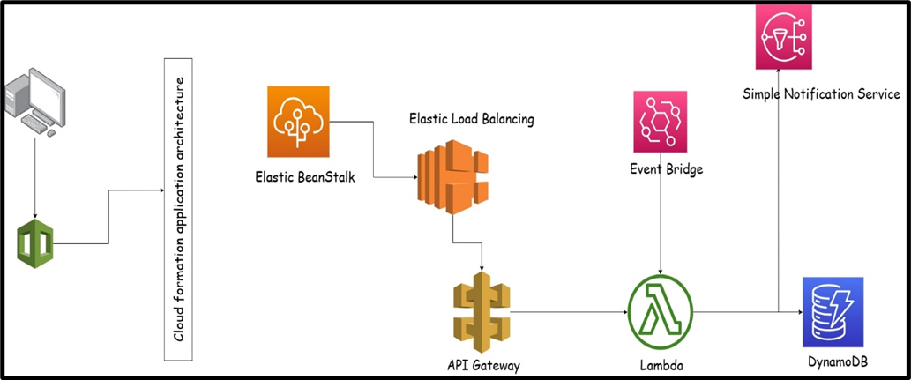

## Getting Started

### Prerequisites

- Node.js
- AWS Account
- AWS CLI configured
- [AWS CloudFormation](https://aws.amazon.com/cloudformation/) familiarity

### Installation

1. Clone the repository: `git clone https://git.cs.dal.ca/courses/2023-fall/csci5409/jinays.git`
2. Navigate to the project directory: `cd todo-buddy`
3. Install dependencies:
   npm install

### Configuration
1. Create an AWS DynamoDB table for task storage.
2. Configure AWS Lambda functions and API Gateway using the provided CloudFormation script (cloudformation.yaml).
3. Set up necessary environment variables, such as AWS credentials and API endpoint, in the application. 

### Features
1. User Authentication: Secure user accounts with encryption.
2. Task Creation and Management: Create, edit, and delete tasks as needed.
3. Search and Filtering: Efficiently search and filter tasks based on various criteria.
4. Notifications: Receive push notifications from app about important announcement using SNS and Event Bridge.

### AWS Services

#### Compute: EC2, Lambda
#### Storage: DynamoDB
#### Network: VPC, API Gateway
#### Security: Wep Application Firewall
#### Management and Governance: Cloud Watch
#### General: SNS

### Architecture of service flow

### Architecture created from CLoud Formation

The Todo Buddy application utilizes a serverless architecture on AWS, leveraging services like AWS Lambda, DynamoDB, API Gatewa. The frontend is hosted on AWS Elastic Beanstalk, providing a scalable and responsive user interface.